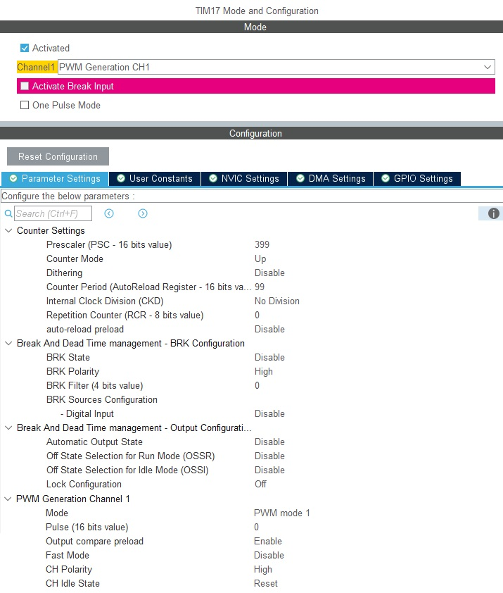
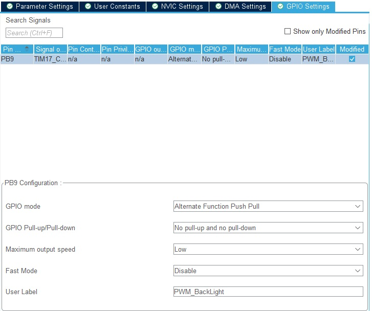
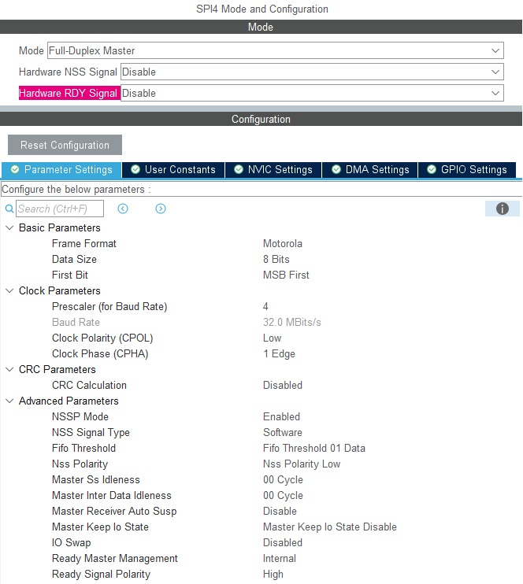
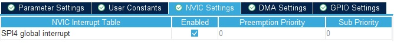
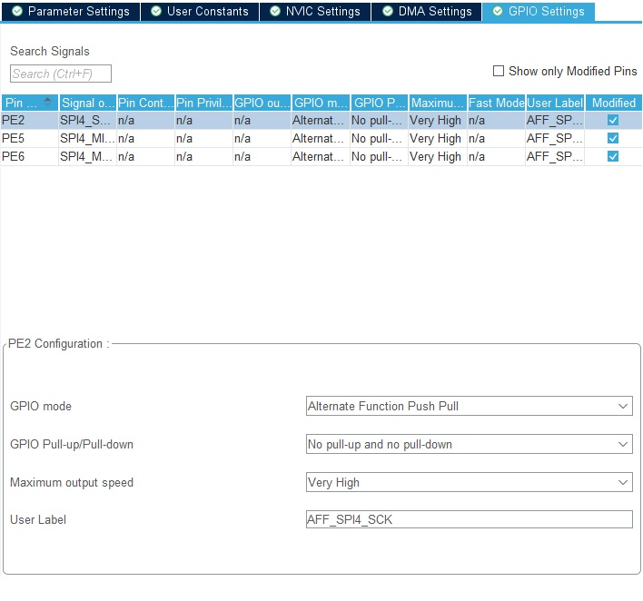

# Display_FF028T010 Lib v1.0


## History Usage 
* 27/05/2025 : Added by @borisC to [TFL4_Cartemere_App](https://git-ext.aldes.com/be-eec/productprojects/confortthermique/chauffe-eau-air/tflow4/tfl4_cartemere_app/-/tree/develop) (STM32H562VGTX)

<span style="color:red">**Attention cett librairie utilise la librairie ST7789 en V1.0**</span>   
**Veuillez suivre la procédure d'intégration de la librairie ST7789 jusqu'a l'étape I.2**

# Procédure pour intégrer cette Librairie
## Etape I : Configurer CubeMX 

**Dans CubeMX :**
1) Dans l'onglet `Clock Configuration`, selectionner le bon clock mux pour avoir 128 MHz sur la SPI connecter à l'afficheur

1) Dans l'onglet `Pinout & Configuration`, `System Core` -> `GPIO` -> `GPIO Mode and Configuration` -> Onglet `GPIO`, Pour les pins `afficheur_CS` et `afficheur_D/C`, configurer les options ainsi :
	* GPIO output level = `Low`
    * GPIO mode = `Output Push Pull`
    * GPIO Pull-up/Pull-down = `No pull-up and no pull-down`
    * Maximum output speed = `Low` ("Low" est généralement suffisant pour notre usage)
	* User Label : Indiquer le nom de la fonction associée, 

1) Dans `Timers` -> `TIMX` Activer la PWM connecter au Backlight de l'afficheur et configurer comme suis :
	* 
	*   

2) Dans `Connectivity` -> `SPIX`, Activer le port SPI connecter à l'afficheur, configurer les options ainsi :
	* 
	* 
	*   

	> Si la vitesse du SPI ne peut pas être à `128MHz`, trouver la bonne paire entre l'horloge et le Prescaler pour avoir un BaudRate d'environ `30 MBits/s`

3) Dans l'onglet général `Project Manager` -> `Advanded Settings` -> `Driver Selector` :
    * s'assurer que GPIO soit bien configuré de type `HAL`
	* s'assurer que TIM soit bien configuré de type `HAL`
	* s'assurer que SPI soit bien configuré de type `HAL`

1) Dans `ProjectManager -> Code Generator` s'assurer des Paramètres suivants :
	* `Generate peripheral initialization as a pair of '.c/.h' files per peripheral` -> Coché
	* `Keep User Code when re-generating` -> Coché
	* Je recommande de Cocher également `Delete previously generated files when not re-generated`

Remarque : je recommande de re- `GENERATE CODE` si l'un des paramètres ci-dessus est modifié !


## Etape II : Configurer le Projet 
**Dans le nouveau Projet**

1) Ajouter le Dossier `SteliauDisplay_FF028T010` à l' `IncludePath` pour toutes les Configs de Build    
(Attention : CubeIDE a l'habitude de stocker les chemins relatifs au Workspace, et non au Dossier)   
il est souvent préférable d'utiliser la formulation `../User/SteliauDisplay_FF028T010` (sans les guillemets) 

*Info : Pour vérifier, sélectionner `Properties` du Projet -> `C/C++ Build` -> `Settings` -> `Tool Settings` -> `MCU GCC Compiler` -> `Include paths`.*

2) Vérifier que le Dossier `SteliauDisplay_FF028T010` ne soit pas `Exclude From Build` des Config. (y compris `Debug` & `Release`)  

*Info : Pour vérifier, sélectionner `Properties` du Dossier -> `C/C++ Build` -> `Settings`.*

3) Définir les signaux HW des GPIOs, de la SPI et de la PWM utiliser par l'afficheur dans le fichier `Display_FF028T010_conf.h`    

	```C
	/*** BSP / HW configuration ***********************************************/
	#define hLCDSPI                         hspi4
	#define LCD_SPI_INIT                    MX_SPI4_Init

	/* CS Pin mapping */
	#define LCD_CS_GPIO_PORT                GPIOE
	#define LCD_CS_GPIO_PIN                 GPIO_PIN_4

	/* DCX Pin mapping */
	#define LCD_DCX_GPIO_PORT               GPIOE
	#define LCD_DCX_GPIO_PIN                GPIO_PIN_3

	/* RESET Pin mapping */
	#define LCD_RESET_GPIO_PORT             GPIOC
	#define LCD_RESET_GPIO_PIN              GPIO_PIN_4

	/* BackLight PWM pin */
	#define LCD_BACKLIGHT_HANDLE            &htim17
	#define LCD_BACKLIGHT_CHANNEL_ID        TIM_CHANNEL_1	// TIM17_CH1
	```

4) Définir l'orientation de l'afficheur dans le fichier `Display_FF028T010_conf.h`    

	```C
	/*** Display configuration ***********************************************/
	#define LCD_ORIENTATION            		ST7789_ORIENTATION_LANDSCAPE
	```

5) Dans le fichier `main.c/cpp` rajouter l'include de la librairie

	```C
	/* Private includes ----------------------------------------------------------*/
	/* USER CODE BEGIN Includes */
	#include "Display_FF028T010.h"
	```

6) Desactiver l'init de la SPI et appeler l'init du display à la place dans le fichier `main.c/cpp`

	```C
	/* Initialize all configured peripherals */
	//MX_SPI4_Init();
	/* USER CODE BEGIN 2 */

	Display_FF028T010_Init();
	```

7) Envoyer le(s) bloc(s) d'images à afficher comme suit

	```C
	uint32_t col = LCD_HEIGHT;
	uint32_t line = LCD_WIDTH;
	uint32_t size = line * col;
	uint16_t pData[size];
	rgb565 pixColor;
	pixColor.color = 3968; // Green

	for(uint32_t i = 0; i < size; i++){
	  pData[i] = pixColor.color;
	}

	BSP_LCD_SetDisplayWindow(0, 0, line, col);
	BSP_LCD_WriteData((uint8_t*)pData, size * BSP_LCD_GetPixelDepth());
	```

8) Controler si l'afficheur est toujours actif via la fonction `Display_FF028T010_isAlive()`    
	Pour savoir si l'afficheur est actif/présent on a besoin de lire l'ID à la bonne vitesse.     
	En temps normal on ne fait que transférer sans avoir de retour et on ne peut savoir si on envoie dans le "vide"   
	
9) Pour Controler le rétro éclairage utilise la fonction `Display_FF028T010_setBackLightLevel()`    
	Il est réglable de 10 à 100% 
	
<span style="color:red">Attention la dataSize de la HAL SPI est configurer en 16bits => "HAL_SPI_Transmit" & "HAL_SPI_Receive" </span>   
La fonction "LCD_IO_SendData" enchaine les transmitions pour palier à la limitation.  
Par contre Les fonctios "LCD_IO_RecvData", et "LCD_IO_WriteReg" n'ont pas la fonctionnalité 


Félicitations, c'est prêt :-) !

